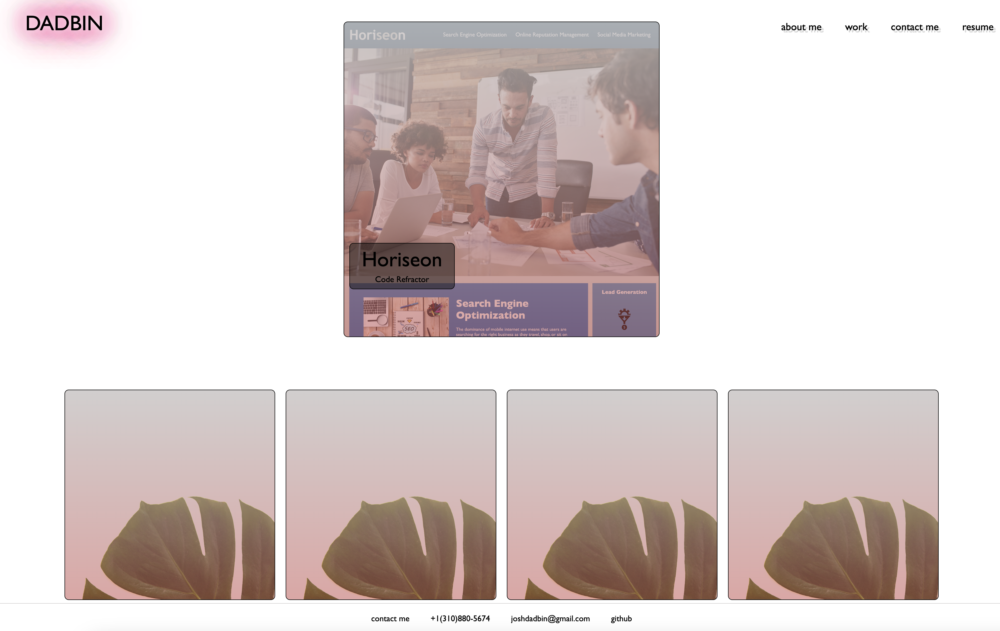

# Joshua Dadbin's Portfolio

## A showcase of the great Joshua Dadbin's coding work

- This website is in hopes to inspires others on the great things that can be accomplished through coding.
- This website will aid in getting showing people how well I know coding and the many languages of coding.

## Table of Contents (Optional)

If your README is long, add a table of contents to make it easy for users to find what they need.

- [Installation](#installation)
- [Usage](#usage)
- [Credits](#credits)
- [License](#license)

## Installation

N/A

## Usage

[Link to Site](https://autohome.github.io/Portfolio/)

## Credits

Reset CSS: Provided from http://meyerweb.com/eric/tools/css/reset/ 

Backgrund Image: Created by Adrien Olichon via Pexels

Card placeholder Image: Dominika Roseclay via Pexels

## License

MIT License
